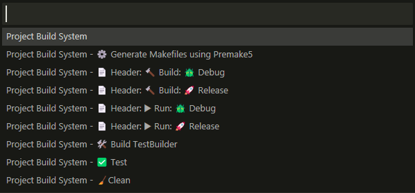

# MarkdownPP
Header only library for parsing markdown to Abstract Syntax Tree (AST).


### Build
- Windows
  - Sublime Text
  
    If you have Sublime Text installed, you could just set Build System to `Project Build System`, then access the build commands with `Ctrl+Shift+B`
    
    
  - Command Line
    - Generate Makefiles using Premake5
      ```powershell
      $ .\premake5.exe --cc=mingw gmake2
      ```
    - Build Debug version
      ```powershell
      $ mingw32-make config=debug
      ```
      This will place the executable in `.\bin\Debug\`
    - Build Release version
      ```powershell
      $ mingw32-make config=release
      ```
      This will place the executable in `.\bin\Release\`
    - Build TestBuilder
      ```powershell
      $ .\TestBuilder.bat
      ```
    - Run Tests
      ```powershell
      $ .\Test.bat
      ```
    - Clean project
      ```powershell
      $ .\Clean.bat
      ```
- Unix (macOS & Linux)
  - Install [Premake5](https://premake.github.io/)
  - Sublime Text
    - Working on the build system to make it cross platform.
  - Command Line
    - Generate Makefiles using Premake5
      ```bash
      $ ./premake5 --cc=gcc gmake2
      ```
    - Build Debug version
      ```bash
      $ make config=debug
      ```
      This will place the executable in `./bin/Debug/`
    - Build Release version
      ```bash
      $ make config=release
      ```
      This will place the executable in `./bin/Release/`
    - Build TestBuilder
      ```bash
      $ cd ./tests/
      $ g++ --std=c++20 -O3 ./TestBuilder.cpp -o ./MarkdownParser__TestsBuilder
      ```
    - Run Tests
      ```bash
      $ ./MarkdownParser__TestsBuilder ./tests/ ./main.cpp
      $ g++ --std=c++20 -O3 ./main.cpp -o ./../bin/Debug/MarkdownParser__Tester
      $ ./../bin/Debug/MarkdownParser__Tester
      ```
    - Clean project
      ```bash
      $ rm -rf ./bin
      $ rm -rf ./obj
      $ rm *.make
      $ rm Makefile
      $ rm ./tests/MarkdownParser__TestsBuilder
      ```

### Credits
Thanks to [Aaron Fu Lei](https://github.com/aafulei) for his [color-console](https://github.com/aafulei/color-console). It helped me move from printing boring white to colorful Test Logs.
